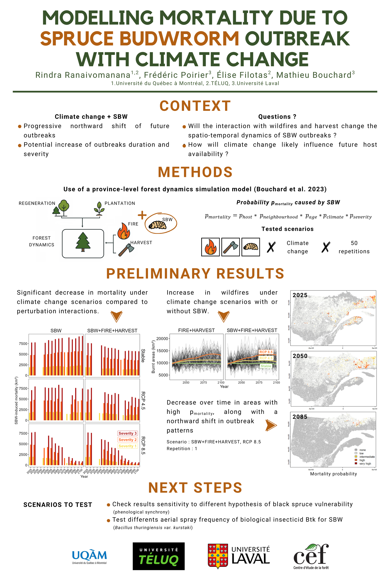

Modeling landscape-level mortality due to spruce budworm outbreaks in a changing climate.   

*(fr)* Modélisation de la mortalité à l'échelle du paysage due aux épidémies de tordeuses de bourgeons de l'épinette dans un contexte de changement climatique.  

**References :**    
Mathieu Bouchard, Núria Aquilué, Élise Filotas, Jonathan Boucher, and Marc-André Parisien. 2023. Forecasting wildfire-induced declines in potential forest harvest levels across Québec. Canadian Journal of Forest Research. 53(2): 119-132. [https://doi.org/10.1139/cjfr-2022-0186](https://doi.org/10.1139/cjfr-2022-0186)

Mathieu Bouchard, Núria Aquilué, Catherine Périé, Marie-Claude Lambert, Tree species persistence under warming conditions: A key driver of forest response to climate change, Forest Ecology and Management, Volume 442, 2019, Pages 96-104, ISSN 0378-1127, [https://doi.org/10.1016/j.foreco.2019.03.040](https://doi.org/10.1016/j.foreco.2019.03.040)  

More information on the conference <a href="https://www.cef-cfr.ca/pmwiki.php?n=Colloque.Colloque2025" target="_blank" rel="noopener noreferrer">here</a>.

{:target="_blank" rel="noopener"}

