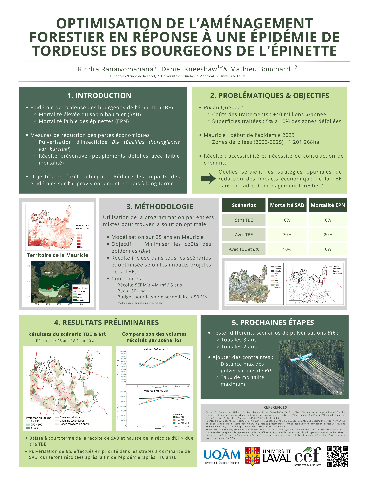

Optimisation de l’aménagement forestier en réponse à une épidémie de tordeuse des bourgeons de l'épinette.

*(en)* Optimizing forest management strategies in response to spruce budworm outbreaks.

**References :**    
- Bauce, É., Dupont, A., Hébert, C., Berthiaume, R., & Quezada-García, R. (2024). Biennial aerial application of Bacillus thuringiensis var. kurstaki provides good protection against spruce budworm (Choristoneura fumiferana [Clemens]). Annals of Forest Science, 81, 12. https://doi.org/10.1186/s13595-024-01260-9
- Fuentealba, A., Dupont, A., Hébert, C., Berthiaume, R., Quezada-García, R., & Bauce, É. (2019). Comparing the efficacy of various aerial spraying scenarios using Bacillus thuringiensis to protect trees from spruce budworm defoliation. Forest Ecology and Management, 432, 101–109. https://doi.org/10.1016/j.foreco.2018.09.026 
- MINISTÈRE DES FORÊTS, DE LA FAUNE ET DES PARCS (2015). L’aménagement forestier dans un contexte d’épidémie de la tordeuse des bourgeons de l’épinette – Guide de référence pour moduler les activités d’aménagement dans les forêts privées, ministère des Forêts, de la Faune et des Parcs, Direction de l’aménagement et de l’environnement forestiers, Direction de la protection des forêts, 87 p.

More information on the conference <a href="https://www.cef-cfr.ca/pmwiki.php?n=Colloque.Colloque2026" target="_blank" rel="noopener noreferrer">here</a>.

{:target="_blank" rel="noopener"}  
